# 🏥 Patient Data Management System

<div align="center">


A fully-featured **Hospital Patient Data Management System** built with **C# Windows Forms** and **SQL Server 2022**. The system provides complete CRUD operations across 9 modules — covering patient registration, electronic health records, appointment scheduling, billing, healthcare providers, and ward management — backed by advanced SQL constructs including Views, Stored Procedures, User-Defined Functions, and Triggers.

</div>

---

## 📸 Application Screenshots

<table>
  <tr>
    <td align="center" colspan="3">
      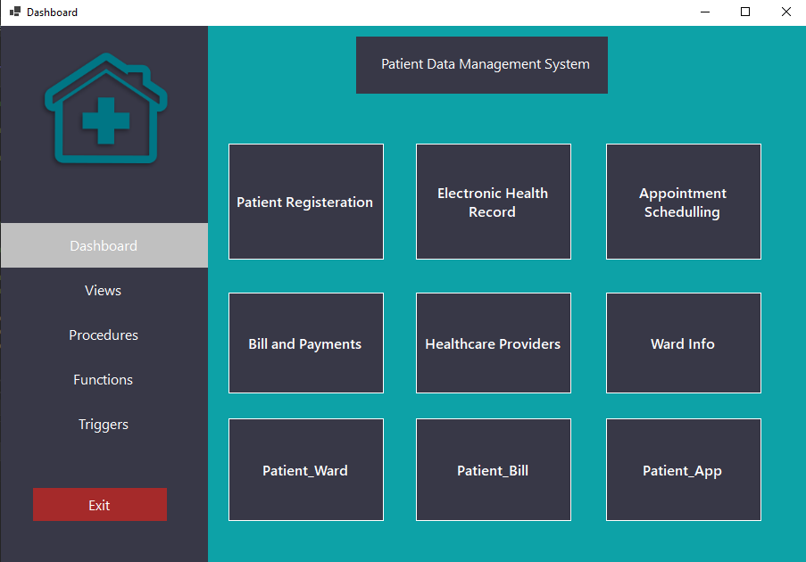<br/>
      <b>🏠 Main Dashboard — 9-Module Navigation Panel</b>
    </td>
  </tr>
  <tr>
    <td align="center">
      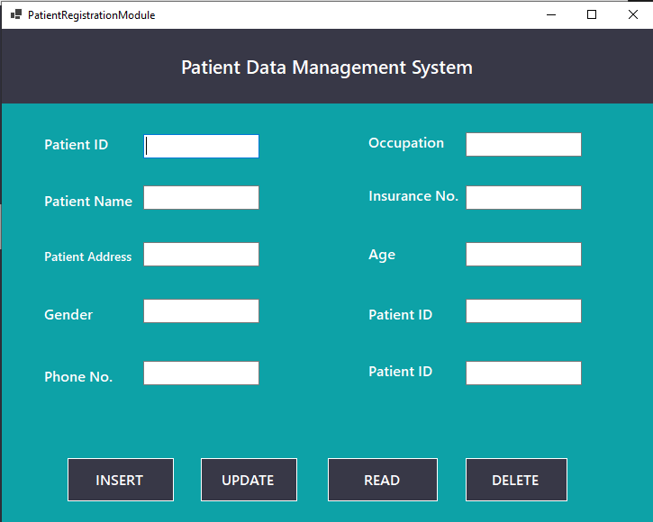<br/>
      <b>📋 Patient Registration Module</b>
    </td>
    <td align="center">
      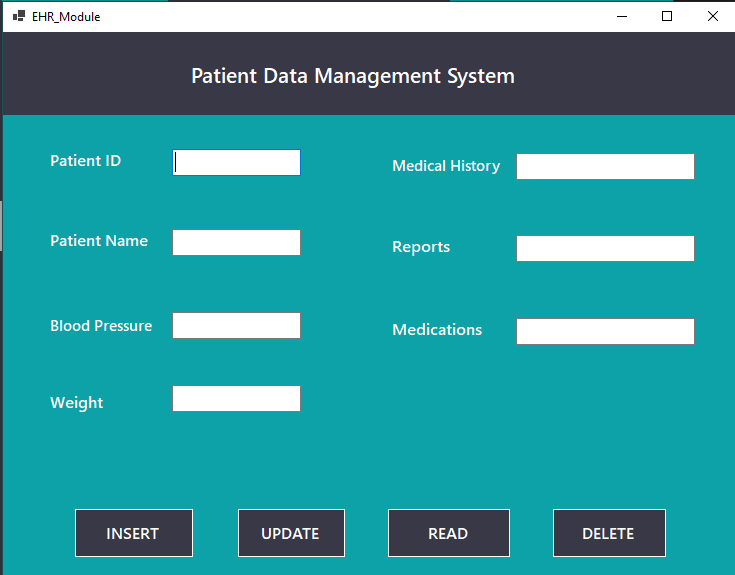<br/>
      <b>🩺 Electronic Health Record (EHR) Module</b>
    </td>
    <td align="center">
      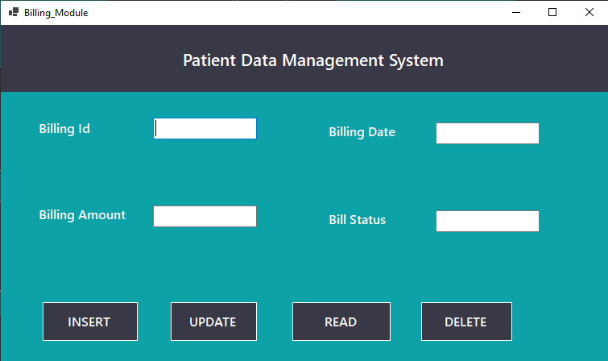<br/>
      <b>💳 Billing & Payments Module</b>
    </td>
  </tr>
  <tr>
    <td align="center">
      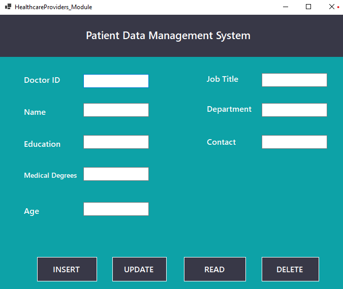<br/>
      <b>👨‍⚕️ Healthcare Providers (Doctors) Module</b>
    </td>
    <td align="center">
      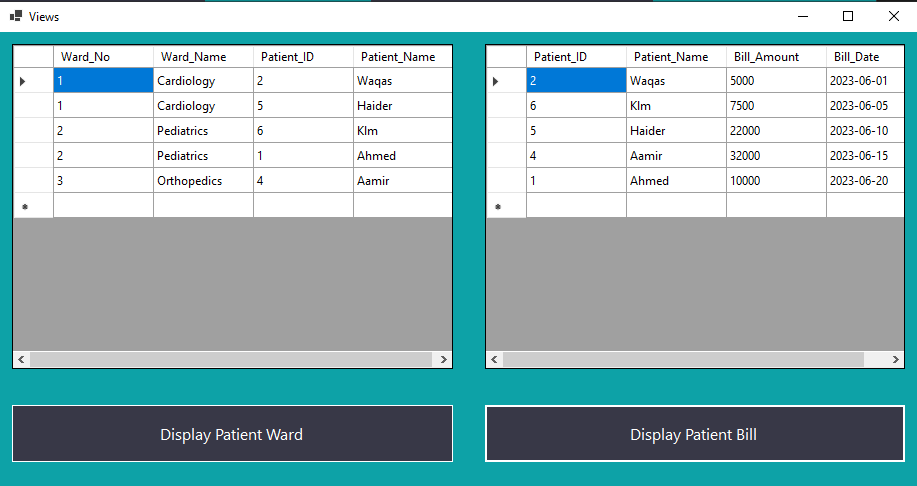<br/>
      <b>📊 SQL Views — Ward & Bill Data Grid</b>
    </td>
    <td align="center">
      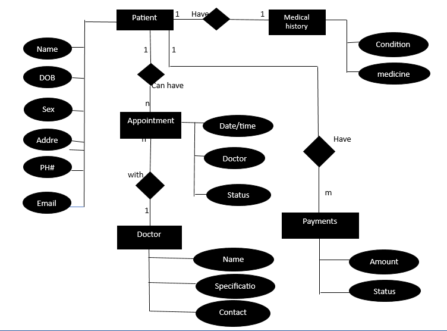<br/>
      <b>🗃️ Entity-Relationship Diagram</b>
    </td>
  </tr>
</table>

---

## 🗄️ Advanced SQL — Live Query Results

<table>
  <tr>
    <td align="center">
      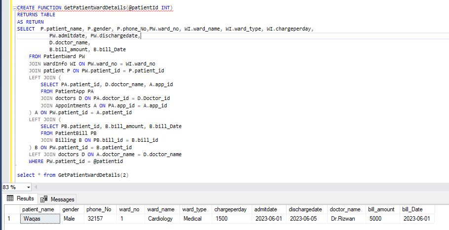<br/>
      <b>⚙️ UDF: GetPatientWardDetails — Multi-Join Function</b>
    </td>
    <td align="center">
      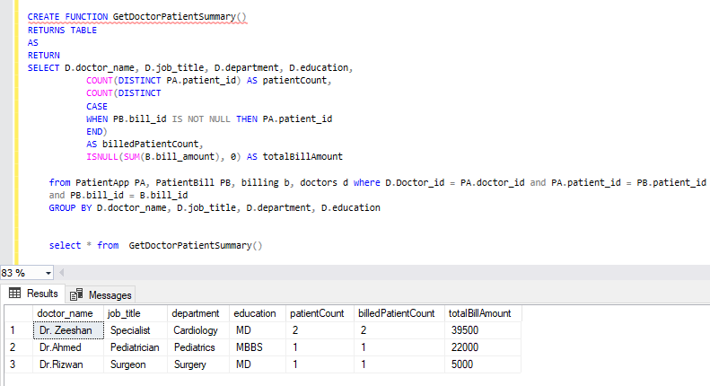<br/>
      <b>⚙️ UDF: GetDoctorPatientSummary — Aggregation Function</b>
    </td>
  </tr>
  <tr>
    <td align="center">
      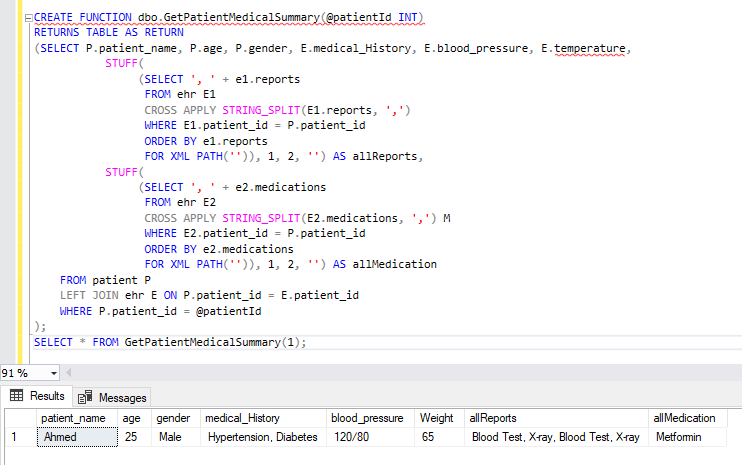<br/>
      <b>⚙️ UDF: GetPatientMedicalSummary — STRING_SPLIT + STUFF</b>
    </td>
    <td align="center">
      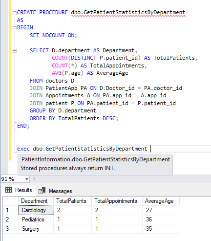<br/>
      <b>🔧 Stored Procedure: GetPatientStatsByDept — AVG/COUNT/GROUP BY</b>
    </td>
  </tr>
  <tr>
    <td align="center">
      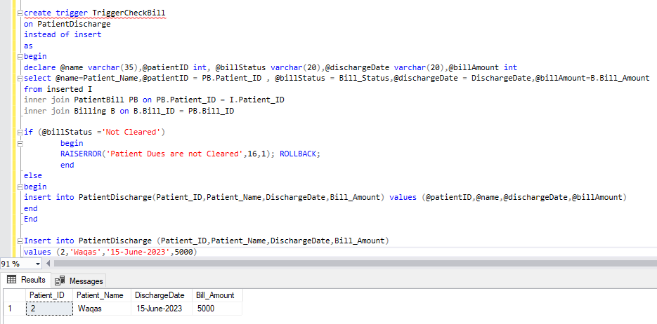<br/>
      <b>⚡ Trigger: TriggerCheckBill — INSTEAD OF INSERT Guard</b>
    </td>
    <td align="center">
      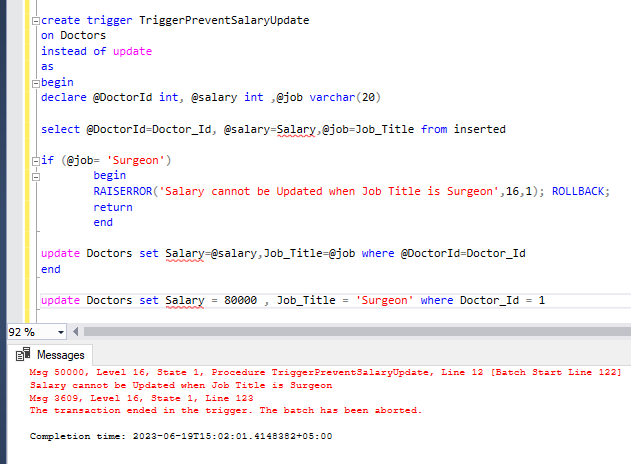<br/>
      <b>⚡ Trigger: TriggerPreventSalaryUpdate — RAISERROR + ROLLBACK</b>
    </td>
  </tr>
</table>

---

## ✨ Application Modules

| Module | Description | Key Fields |
|---|---|---|
| **🏠 Dashboard** | Central hub with 9 navigation tiles + sidebar (Views, Procedures, Functions, Triggers) | — |
| **📋 Patient Registration** | Full CRUD for patient demographics | ID, Name, Address, Gender, Phone, Occupation, Insurance No., Age |
| **🩺 Electronic Health Records** | EHR CRUD with clinical vitals | Medical History, Blood Pressure, Weight, Reports, Medications |
| **📅 Appointment Scheduling** | Manage doctor appointments | App ID, Patient ID, Doctor, Date, Status |
| **💳 Bill & Payments** | Billing lifecycle management | Bill ID, Amount, Date, Status (Cleared/Not Cleared) |
| **👨‍⚕️ Healthcare Providers** | Doctor/specialist records | Doctor ID, Name, Education, Degrees, Job Title, Department, Contact, Age |
| **🏨 Ward Info** | Hospital ward management | Ward No, Name, Type, Charge/Day, Bed Capacity |
| **📤 Patient Ward** | Patient admission/discharge tracking | Admit Date, Discharge Date, Ward Assignment |
| **💰 Patient Bill** | Patient–Billing bridge records | Patient-to-Bill linkage |
| **📲 Patient App** | Patient–Appointment bridge records | Patient-to-Appointment linkage |

All modules support **INSERT**, **UPDATE**, **READ**, and **DELETE** operations via the C# `SQLConnection` abstraction layer.

---

## 🗃️ Database Schema — `PatientInformation`

### Tables

| Table | Primary Key | Key Columns |
|---|---|---|
| `Patient` | `Patient_ID` | Name, Address, Gender, Phone_No, Occupation, Insurance_No, Age |
| `Billing` | `Bill_ID` | Bill_Amount, Bill_Date, Bill_Status |
| `WardInfo` | `Ward_No` | Ward_Name, Ward_Type, ChargePerDay, Bed_Capacity |
| `doctors` | `Doctor_id` | Doctor_name, Job_Title, Department, Education, Salary, Contact |
| `ehr` | `patient_id` | medical_History, blood_pressure, temperature, reports, medications |
| `Appointments` | `app_id` | app_date, app_status |
| `PatientWard` | — | Ward_No, Patient_ID, AdmitDate, DischargeDate |
| `PatientBill` | — | Bill_ID, Patient_ID |
| `PatientApp` | — | app_id, patient_id, doctor_id |
| `PatientDischarge` | — | Patient_ID, Patient_Name, DischargeDate, Bill_Amount |

### Views

| View | Purpose |
|---|---|
| `DisplayPatientWard` | Joins `WardInfo` + `PatientWard` + `Patient` to show ward occupancy |
| `DisplayPatientBill` | Joins `Billing` + `PatientBill` + `Patient` to show billing summary |
| `example_view` | Filters patients with billing amount > 7000 |

---

## ⚙️ Stored Procedures

### `GetPatientStatisticsByDepartment`
```sql
-- Groups patients by department, returns TotalPatients, TotalAppointments, AverageAge
SELECT D.department, COUNT(DISTINCT P.patient_id) AS TotalPatients,
       COUNT(*) AS TotalAppointments, AVG(P.age) AS AverageAge
FROM doctors D
JOIN PatientApp PA ON D.Doctor_id = PA.doctor_id
JOIN Appointments A ON PA.app_id = A.app_id
JOIN patient P ON PA.patient_id = P.patient_id
GROUP BY D.department ORDER BY TotalPatients DESC;
```

---

## ⚡ User-Defined Functions

### `GetPatientWardDetails(@patientId INT)` — RETURNS TABLE
Multi-join function returning complete patient ward + appointment + billing data in one call:
```sql
SELECT P.patient_name, P.gender, PW.ward_no, WI.ward_name, WI.ward_type, WI.chargeperday,
       PW.admitdate, PW.dischargedate, D.doctor_name, B.bill_amount, B.bill_Date
FROM PatientWard PW
JOIN WardInfo WI ON PW.ward_no = WI.ward_no
JOIN patient P ON PW.patient_id = P.patient_id
LEFT JOIN (...) A ON PW.patient_id = A.patient_id
LEFT JOIN (...) B ON PW.patient_id = B.patient_id
WHERE PW.patient_id = @patientId
```

### `GetDoctorPatientSummary()` — RETURNS TABLE
Aggregates doctor workload: patient count, billed patient count, and total revenue per doctor.

### `GetPatientMedicalSummary(@patientId INT)` — RETURNS TABLE
Uses `STUFF` + `STRING_SPLIT` + `FOR XML PATH` to concatenate comma-separated reports and medications into single-row clinical summary.

---

## 🔥 Triggers

### `TriggerCheckBill` — `INSTEAD OF INSERT` on `PatientDischarge`
Blocks discharge if billing status is `'Not Cleared'`, raises error and rolls back:
```sql
IF (@billStatus = 'Not Cleared')
    BEGIN
        RAISERROR('Patient Dues are not Cleared', 16, 1); ROLLBACK;
    END
```

### `TriggerPreventSalaryUpdate` — `INSTEAD OF UPDATE` on `Doctors`
Prevents salary changes for Surgeons:
```sql
IF (@job = 'Surgeon')
    BEGIN
        RAISERROR('Salary cannot be Updated when Job Title is Surgeon', 16, 1); ROLLBACK;
    END
```

---

## 🏗️ C# Project Architecture

```
PatientDataManagementSystem_2/
│
├── 🖥️  Dashboard.cs/.Designer.cs     — Main navigation hub
├── 📋  PatientRegistrationModule.cs   — Patient CRUD form
├── 🩺  EHR_Module.cs                 — Electronic Health Record CRUD
├── 📅  Appointment.cs                — Appointment scheduling
├── 💳  Billing_Module.cs             — Billing management
├── 👨‍⚕️  HealthcareProviders.cs        — Doctor management
├── 🏨  WardInfo.cs / Ward_Info.cs    — Ward info CRUD
├── 📤  PatientWard.cs / Patient_Ward.cs — Patient-Ward assignment
├── 💰  PatientBill.cs / Patient_Bill.cs — Patient-Bill records
├── 📲  Patient_App.cs               — Patient appointments
│
├── 🔌  SQLConnection.cs              — Centralised SQL Server connection + query helper
├── 🔧  StoredProcedures.cs           — Stored procedure viewer/runner
├── ⚙️   Views.cs                      — SQL Views viewer
├── ⚡  Triggers.cs                   — Triggers viewer
├── 📊  Patient.cs                    — Patient class model
│
└── 📦  PatientDataManagementSystem_2.csproj
```

### `SQLConnection.cs` — Connection Pattern
```csharp
// Centralised SQL Server connection helper
SqlConnection conn = new SqlConnection("Data Source=.;Initial Catalog=PatientInformation;Integrated Security=True");
conn.Open();
SqlCommand cmd = new SqlCommand(query, conn);
SqlDataAdapter adapter = new SqlDataAdapter(cmd);
DataTable dt = new DataTable();
adapter.Fill(dt);
```

---

## 🚀 Setup & Installation

### Prerequisites
- **Visual Studio 2019+** (with .NET Framework 4.x)
- **SQL Server 2019/2022** (Developer or Express edition)
- **SQL Server Management Studio (SSMS)**

### Steps

1. **Clone this repository:**
   ```bash
   git clone https://github.com/AnasQ2003/PATIENT_MANAGEMENT_SYSTEM.git
   ```

2. **Restore the database:**
   - Open SSMS and connect to your local SQL Server instance
   - Open `script.sql` from the repository root
   - Execute the entire script — it creates `PatientInformation` database, all tables, views, procedures, functions, triggers, and sample data

3. **Open the C# project:**
   - Open `DBMS FINAL FORMS\PatientDataManagementSystem_2\PatientDataManagementSystem_2.csproj` in Visual Studio

4. **Update connection string** in `SQLConnection.cs` if your SQL Server instance name differs:
   ```csharp
   "Data Source=YOUR_INSTANCE;Initial Catalog=PatientInformation;Integrated Security=True"
   ```

5. **Build and run** (F5 or `Ctrl+F5`)

---

## 🧠 DBMS Concepts Applied

| Concept | Implementation |
|---|---|
| **Relational Model** | 10 normalised tables with primary/foreign key constraints |
| **SQL Views** | `DisplayPatientWard`, `DisplayPatientBill`, `example_view` |
| **Stored Procedures** | `GetPatientStatisticsByDepartment` — GROUP BY + AVG + COUNT |
| **User-Defined Functions** | `GetPatientWardDetails`, `GetDoctorPatientSummary`, `GetPatientMedicalSummary` |
| **Triggers** | `TriggerCheckBill` (INSTEAD OF INSERT), `TriggerPreventSalaryUpdate` (INSTEAD OF UPDATE) |
| **STRING_SPLIT + STUFF** | Used in medical summary UDF for multi-value concatenation |
| **Multi-table JOINs** | Up to 5-table joins with LEFT JOIN for optional data |
| **ER Diagram** | Entity-Relationship model for Patient, Doctor, Appointment, Payment |
| **ADO.NET** | C# data access via `SqlConnection`, `SqlCommand`, `SqlDataAdapter` |
| **Windows Forms** | Full GUI with INSERT/UPDATE/READ/DELETE on all modules |

---

## 📂 Repository Files

```
PATIENT_MANAGEMENT_SYSTEM/
│
├── 📄 script.sql                     — Complete DB creation script (tables, views, SPs, UDFs, triggers, data)
├── 📁 screenshots/
│   ├── dashboard.png                 — Main 9-module dashboard
│   ├── patient_registration.png      — Patient CRUD form
│   ├── ehr_module.png                — EHR form
│   ├── billing_module.png            — Billing form
│   ├── doctor_module.png             — Healthcare providers form
│   ├── views_screen.png              — SQL Views data grids
│   ├── er_diagram.png                — Entity-Relationship diagram
│   ├── sql_view_displaybill.png      — DisplayPatientBill view result
│   ├── stored_procedure_stats.png    — Department statistics SP result
│   ├── function_ward_details.png     — GetPatientWardDetails UDF result
│   ├── function_doctor_summary.png   — GetDoctorPatientSummary UDF result
│   ├── function_medical_summary.png  — GetPatientMedicalSummary UDF result
│   ├── trigger_check_bill.png        — TriggerCheckBill in action
│   └── trigger_prevent_salary.png    — TriggerPreventSalaryUpdate in action
└── 📦 DBMS LAB PROJECT.zip           — Full C# solution + report archive
```

---

## 📚 Course Context

| Detail | Info |
|---|---|
| **University** | Bahria University, Karachi Campus |
| **Department** | Department of Computer Science |
| **Course** | Database Management Systems Lab (CEL-212) |
| **Semester** | 4th Semester |
| **Class** | BSCS 4A |
| **Group Members** | Anas Ahmed, Waqas, Hassan Ali |

---

## 📄 License

```
MIT License

Copyright (c) Patient Management System---2026 AnasQ2003

Permission is hereby granted, free of charge, to any person obtaining a copy
of this software and associated documentation files (the "Software"), to deal
in the Software without restriction, including without limitation the rights
to use, copy, modify, merge, publish, distribute, sublicense, and/or sell
copies of the Software, and to permit persons to whom the Software is
furnished to do so, subject to the following conditions:

The above copyright notice and this permission notice shall be included in all
copies or substantial portions of the Software.

THE SOFTWARE IS PROVIDED "AS IS", WITHOUT WARRANTY OF ANY KIND, EXPRESS OR
IMPLIED, INCLUDING BUT NOT LIMITED TO THE WARRANTIES OF MERCHANTABILITY,
FITNESS FOR A PARTICULAR PURPOSE AND NONINFRINGEMENT.
```

---

## 👨‍💻 Author

**Anas Ahmed Qureshi.** — [@AnasQ2003](https://github.com/AnasQ2003)

---

<div align="center">
  <p>Built with ❤️ by <strong>Anas</strong></p>
  
 <div align="center">

Made with 🔥 and a lot of ☕

**⭐ If you found this useful, please star the repository!**

</div>
